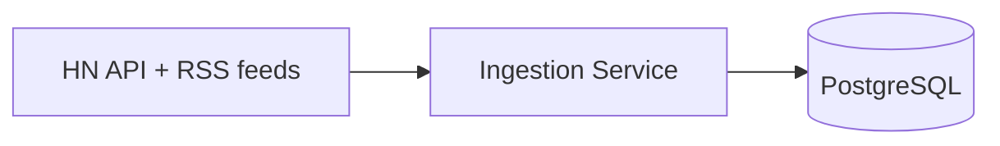
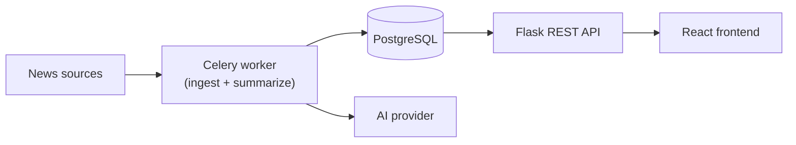

<div align="center">

# TechDigest

**An AI-powered technology news aggregator, built on an async-first Flask backend.**

[](backend/requirements.txt)
[](backend/requirements.txt)
[](docker-compose.yml)
[](#roadmap)

</div>

---

Users get a single feed of technology news pulled from multiple sources, each article summarized by AI. The feed is the point; the async backend behind it exists to keep fetching and summarizing — both slow, unreliable operations — from ever blocking what a user actually sees.

## Why this project exists

Reading tech news well means checking a handful of different sources and skimming past long articles for the actual point. TechDigest aggregates sources into one feed and summarizes each article with AI, with all of the slow work happening asynchronously so the app itself always stays fast. Full problem statement, target users, and MVP scope: [docs/project-definition.md](docs/project-definition.md).

## Engineering approach

This is built in deliberate, documented milestones, not as fast as possible — and it's honest about what's actually done versus planned:

- **No invented metrics.** This project replaces an earlier version of itself that overclaimed on a resume — "500+ users," production deployment — none of which existed. Every claim in this README is something you can clone the repo and verify yourself.
- **Naive approach, documented, then the fix.** Every non-trivial design decision in [docs/architecture.md](docs/architecture.md) is written as: the simple version, why it breaks, and the actual fix — not just the end result presented as obvious.
- **Database-enforced guarantees, not just application checks.** Article deduplication has a fast application-side check, but the real guarantee is a database-level unique constraint with proper race-condition handling — verified with a test that simulates the race, not just trusted.
- **Deliberate scope boundaries.** Features explicitly out of scope for now (recommendations, multi-language, notifications) are documented as decisions in [docs/project-definition.md](docs/project-definition.md), not silently absent.
- **Tests where they earn their keep.** 17 tests, zero live network calls — all external HTTP is mocked — with the trickier logic (dedup, race handling) actually exercised against a real Postgres test database, not faked.

## What's actually working right now

- A Flask REST API (app factory, environment-based config, health check)
- A seven-table PostgreSQL schema (articles, sources, summaries, bookmarks, users, ingestion jobs, processing failures) with Alembic migrations applied
- An ingestion pipeline pulling real articles from the Hacker News API and three RSS feeds (TechCrunch, Ars Technica, The Verge), normalized into one common shape and deduplicated by canonical URL and title hash
- 17 automated tests (`pytest`), all external HTTP mocked
- Local Postgres + Redis via Docker Compose

## Architecture

**Current state** — what's actually running:



**Target state** — the full system this is building toward:



Full data flow, failure handling, and the deduplication strategy: [docs/architecture.md](docs/architecture.md).

## Tech stack

| Layer | In use today | Why |
|---|---|---|
| Backend | Flask, SQLAlchemy, Alembic | App factory pattern for clean test isolation; migrations instead of hand-run SQL |
| Database | PostgreSQL | Real foreign keys, unique constraints, and transactions — the data is genuinely relational |
| Ingestion | `requests`, `feedparser` | Standard, well-tested HTTP and feed-parsing libraries over hand-rolled parsing |
| Testing | Pytest, `unittest.mock` | Full suite runs with zero live network calls |
| Local dev | Docker Compose | One-command Postgres + Redis for local development |

| Layer | Planned | Milestone |
|---|---|---|
| Async processing | Celery + Redis, an AI provider client (Ollama default, swappable) | M3 — in progress |
| Validation | Marshmallow | M4 |
| Frontend | React, TypeScript, Tailwind, TanStack Query, Vitest | M5 |
| CI/CD | GitHub Actions | M6 |
| Deployment | Netlify/Vercel + Render/Railway + Neon + Upstash | M7 |

## Roadmap

- [x] M0 — Architecture & repo skeleton
- [x] M1 — Backend foundation
- [x] M2 — Article ingestion pipeline
- [ ] M3 — Asynchronous processing *(current)*
- [ ] M4 — REST API
- [ ] M5 — Frontend
- [ ] M6 — CI/CD
- [ ] M7 — Deployment
- [ ] M8 — Documentation & polish

Full milestone breakdown: [docs/roadmap.md](docs/roadmap.md).

## Repository structure

```
techdigest/
  backend/      Flask API + Celery worker (modular monolith)
    app/
      api/        Routes / blueprints
      clients/    External API clients (news sources, AI provider)
      models/     SQLAlchemy models
      services/   Business logic
      utils/      Shared, dependency-free helpers
    migrations/   Alembic migrations
    scripts/      Manual seed/ingestion scripts
    tests/        Pytest suite, mirrors app/ structure
  frontend/     React + TypeScript SPA (not yet built)
  docs/         Architecture, API, schema, deployment, testing docs
  .github/      CI workflows, issue/PR templates (not yet built)
```

## Local setup

```bash
git clone https://github.com/KayBee1880/TechDigest.git
cd TechDigest
cp .env.example .env   # then edit DATABASE_URL's port if it conflicts with a local Postgres install
```

Start Postgres:
```bash
docker compose up -d db
```

Set up the backend:
```bash
cd backend
python -m venv .venv
.venv\Scripts\Activate.ps1   # Windows; use source .venv/bin/activate on macOS/Linux
pip install -r requirements-dev.txt
flask db upgrade
```

Seed sources and run ingestion:
```bash
python -m scripts.seed_sources
python -m scripts.ingest_articles
```

Run the test suite:
```bash
pytest
```

## Documentation

- [Project definition](docs/project-definition.md) — problem, users, MVP scope, explicit non-goals
- [Architecture](docs/architecture.md) — data flow, async design, dedup, failure handling
- [Roadmap](docs/roadmap.md) — milestone-by-milestone build plan

## License

MIT — see [LICENSE](LICENSE).
