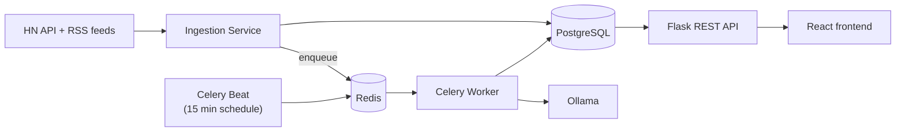

<div align="center">

# TechDigest

**An AI-powered technology news aggregator, built on an async-first Flask backend.**

[](backend/requirements.txt)
[](backend/requirements.txt)
[](docker-compose.yml)
[](#roadmap)

</div>

---

Users get a single feed of technology news pulled from multiple sources, each article summarized by AI. The feed is the point; the async backend behind it exists to keep fetching and summarizing — both slow, unreliable operations — from ever blocking what a user actually sees.

## Why this project exists

Reading tech news well means checking a handful of different sources and skimming past long articles for the actual point. TechDigest aggregates sources into one feed and summarizes each article with AI, with all of the slow work happening asynchronously so the app itself always stays fast. Full problem statement, target users, and MVP scope: [docs/project-definition.md](docs/project-definition.md).

## Engineering approach

This is built in deliberate, documented milestones, not as fast as possible — and it's honest about what's actually done versus planned:

- **No invented metrics.** This project replaces an earlier version of itself that overclaimed on a resume — "500+ users," production deployment — none of which existed. Every claim in this README is something you can clone the repo and verify yourself.
- **Naive approach, documented, then the fix.** Every non-trivial design decision in [docs/architecture.md](docs/architecture.md) is written as: the simple version, why it breaks, and the actual fix — not just the end result presented as obvious.
- **Database-enforced guarantees, not just application checks.** Article deduplication has a fast application-side check, but the real guarantee is a database-level unique constraint with proper race-condition handling — verified with a test that simulates the race, not just trusted.
- **Deliberate scope boundaries.** Features explicitly out of scope for now (recommendations, multi-language, notifications) are documented as decisions in [docs/project-definition.md](docs/project-definition.md), not silently absent.
- **Tests where they earn their keep.** 77 backend tests (`pytest`) plus 9 frontend tests (Vitest + React Testing Library), zero live network calls anywhere — all external HTTP (including the AI provider) is mocked — with the trickier backend logic (dedup, race handling, retry/backoff, task idempotency, per-user bookmark scoping) actually exercised against a real Postgres test database, not faked.

## What's actually working right now

- A Flask REST API (app factory, environment-based config, health check)
- A seven-table PostgreSQL schema (articles, sources, summaries, bookmarks, users, ingestion jobs, processing failures) with Alembic migrations applied
- An ingestion pipeline pulling real articles from the Hacker News API and three RSS feeds (TechCrunch, Ars Technica, The Verge), normalized into one common shape and deduplicated by canonical URL and title hash
- Asynchronous processing: a Celery worker + Beat scheduler (ingestion runs on a 15-minute schedule) with an AI-generated summary produced per article via Ollama, retried with exponential backoff on failure and tracked in `processing_failures`
- AI-based category classification: each article is classified into one of nine CS-field categories in the same Ollama call that generates its summary, filterable via the API
- REST API: article listing with pagination/source/category filter/keyword search, article detail, JWT-based registration/login, and bookmarks CRUD (with personal notes) scoped per user — all request/response validation and serialization via Marshmallow
- A React + TypeScript frontend with an editorial visual design and a light/dark theme toggle: feed (search + category filter + pagination), article detail with bookmarking and inline notes, saved articles, login/register — talking to the real API via React Query, styled with Tailwind CSS
- The feed only ever shows articles with a completed AI summary and category — nothing half-processed is ever shown as if it were finished
- 77 backend tests (`pytest`) + 9 frontend tests (Vitest + RTL), all external HTTP mocked
- A full local dev stack (Postgres, Redis, backend, worker, beat, Ollama) via one `docker compose up`
- CI on every PR (GitHub Actions): Ruff + pytest against a real Postgres service container, ESLint + `tsc` + Vitest, and a Docker image build check

## Architecture

**Current state** — what's actually running, matching the target state below in full:


```mermaid
flowchart LR
    Sources["HN API + RSS feeds"] --> Ingest["Ingestion Service"]
    Ingest --> PG[("PostgreSQL")]
    Ingest -->|enqueue| Redis[("Redis")]
    Beat["Celery Beat<br/>(15 min schedule)"] --> Redis
    Redis --> Worker["Celery Worker"]
    Worker --> AI["Ollama"]
    Worker --> PG
    PG --> API["Flask REST API"]
    API --> FE["React frontend"]
```

Full data flow, failure handling, and the deduplication strategy: [docs/architecture.md](docs/architecture.md).

## Tech stack

| Layer | In use today | Why |
|---|---|---|
| Backend | Flask, SQLAlchemy, Alembic | App factory pattern for clean test isolation; migrations instead of hand-run SQL |
| Database | PostgreSQL | Real foreign keys, unique constraints, and transactions — the data is genuinely relational |
| Ingestion | `requests`, `feedparser` | Standard, well-tested HTTP and feed-parsing libraries over hand-rolled parsing |
| Async processing | Celery + Redis, `AIProviderClient` (Ollama default, swappable) | Decouples slow/unreliable ingestion and AI calls from the request-response cycle |
| Testing | Pytest, `unittest.mock` | Full suite runs with zero live network calls |
| Local dev | Docker Compose | One-command Postgres + Redis + backend + worker + beat + Ollama for local development |
| API validation | Marshmallow, PyJWT | Request/response schemas; JWT for stateless auth |
| Frontend | React 19, TypeScript, Vite, Tailwind CSS v4, TanStack Query, React Router | Typed API client generated to match the backend's own Marshmallow schemas |
| Frontend testing | Vitest, React Testing Library | Query components the way a user would, not by implementation detail |
| CI/CD | GitHub Actions (Ruff, pytest, ESLint, `tsc`, Vitest, Docker build) | Every PR runs lint + tests + a real container build before merge |

| Layer | Planned | Milestone |
|---|---|---|
| Deployment | Netlify/Vercel + Render/Railway + Neon + Upstash | M7 |

## Roadmap

- [x] M0 — Architecture & repo skeleton
- [x] M1 — Backend foundation
- [x] M2 — Article ingestion pipeline
- [x] M3 — Asynchronous processing
- [x] M4 — REST API
- [x] M5 — Frontend
- [x] M6 — CI/CD
- [x] Visual redesign & categories
- [ ] M7 — Deployment
- [ ] M8 — Documentation & polish

Full milestone breakdown: [docs/roadmap.md](docs/roadmap.md).

## Repository structure

```
techdigest/
  backend/      Flask API + Celery worker (modular monolith)
    app/
      api/        Routes / blueprints
      clients/    External API clients (news sources, AI provider)
      models/     SQLAlchemy models
      services/   Business logic
      utils/      Shared, dependency-free helpers
    migrations/   Alembic migrations
    scripts/      Manual seed/ingestion scripts
    tests/        Pytest suite, mirrors app/ structure
  frontend/     React + TypeScript SPA
    src/
      api/        Fetch wrapper, types, and React Query hooks
      auth/       Client-side session state (JWT in localStorage)
      components/ Shared UI (nav/layout)
      pages/      One component per route
    tests/        Vitest + RTL suite, mirrors src/ structure
  docs/         Architecture, API, schema, deployment, testing docs
  .github/      CI workflows, issue/PR templates (not yet built)
```

## Local setup

```bash
git clone https://github.com/KayBee1880/TechDigest.git
cd TechDigest
cp .env.example .env   # then edit DATABASE_URL's port if it conflicts with a local Postgres install
```

Start Postgres:
```bash
docker compose up -d db
```

Set up the backend:
```bash
cd backend
python -m venv .venv
.venv\Scripts\Activate.ps1   # Windows; use source .venv/bin/activate on macOS/Linux
pip install -r requirements-dev.txt
flask db upgrade
```

Seed sources and run ingestion:
```bash
python -m scripts.seed_sources
python -m scripts.ingest_articles
```

Run the test suite:
```bash
pytest
```

Or run the whole stack in Docker (API, worker, beat, Postgres, Redis, Ollama) instead of the host-venv steps above — `.env` can stay in host mode (`localhost:5433`), `docker-compose.yml` overrides the DB URL to the container-correct value automatically:
```bash
docker compose up -d
docker compose exec backend flask db upgrade
docker compose exec backend python -m scripts.seed_sources
docker compose exec ollama ollama pull llama3.2   # one-time, ~2GB
docker compose exec backend python -m scripts.ingest_articles
```

Set up the frontend (needs the backend running via one of the two methods above first):
```bash
cd frontend
npm install
npm run dev       # -> http://localhost:5173
```

Run the frontend test suite:
```bash
cd frontend
npx vitest run
```

## Documentation

- [Project definition](docs/project-definition.md) — problem, users, MVP scope, explicit non-goals
- [Architecture](docs/architecture.md) — data flow, async design, dedup, failure handling
- [Roadmap](docs/roadmap.md) — milestone-by-milestone build plan

## License

MIT — see [LICENSE](LICENSE).
