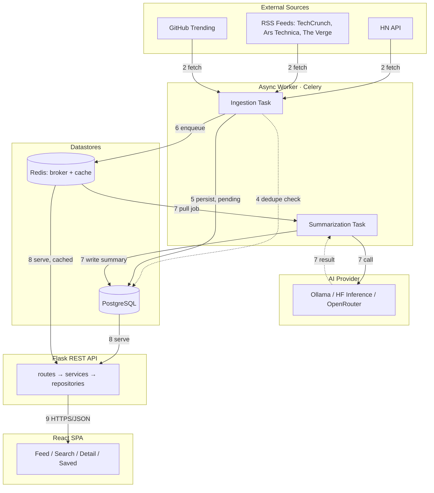

# TechDigest — Architecture

## Component overview

Solid arrows are writes/requests, dashed arrows are reads/responses. Steps 1 (schedule) and 3 (normalize) happen inside the Ingestion Task itself, so they don't appear as arrows between boxes — see below.

## Reading the flow

Each number is one concrete step. Together they answer "where is this article right now, and what happens to it next."

1. **Schedule** — Celery Beat wakes the ingestion task every N minutes, per source. Nothing waits on a user request to trigger this.
2. **Fetch** — `NewsProviderClient` pulls raw, source-specific data (RSS parse or JSON API call) — different field names, different date formats, per source.
3. **Normalize** — raw payloads are mapped into one common shape (title, url, published_at, source, raw_content). Everything downstream only ever deals with this shape.
4. **Deduplicate** — before insert, compute a canonical key (normalized URL + title hash) and check it against `articles`. A match means the task stops here for that article — it does not get summarized twice.
5. **Persist** — new articles are saved with `summary_status = 'pending'`. They're already visible in the feed at this point, just without a summary yet.
6. **Queue summarization** — for each newly-saved article, the ingestion task enqueues one `summarize_article` job on the Celery/Redis queue. Ingestion's job ends here — it does not wait for the summary.
7. **Summarize** — a separate worker pulls the job, calls `AIProviderClient`, and writes the result to `summaries`, flipping `summary_status` to `completed` (or `failed`, with a row in `processing_failures`, on error).
8. **Serve** — the Flask API never talks to the AI provider or news sources directly. It only reads what's already in Postgres, through `ArticleService`/`SearchService`, with Redis caching hot queries (e.g. "latest feed").
9. **Display** — the React app calls the API via React Query, which handles caching, loading, and error states on the client.

## Key design decisions

Each of these follows the same shape: a simpler approach exists, it breaks under a specific failure mode, and the fix addresses that failure mode directly.

### Why background jobs at all

- **Naive approach:** fetch articles and call the AI provider inside the same request/response cycle that serves the page.
- **Why it breaks:** RSS parsing and AI calls are seconds-to-tens-of-seconds, unreliable, I/O-bound operations. One slow or down source makes every page load slow, even for users who never asked for fresh data.
- **The fix:** ingestion and summarization run in a separate Celery worker process/container. The API only ever reads what's already persisted — it's decoupled from anything slow or flaky. This is the core "why async" argument: **decouple slow, unreliable I/O from the request-response cycle.**

### When the AI call fails

- **Naive approach:** if summarization fails, drop the article or crash the whole ingestion batch.
- **Why it breaks:** free-tier AI providers rate-limit and time out. Losing articles because a model was briefly unavailable isn't acceptable.
- **The fix:** the article already exists (step 5) before summarization is even attempted. On failure, retry with exponential backoff (Celery's `autoretry_for` + `retry_backoff`) up to a max (e.g. 5 attempts), logging each failure to `processing_failures`. After the max, `summary_status` is set to `failed` — the article still shows with title/source/link, just without a summary. The AI provider itself sits behind `AIProviderClient` (strategy pattern), so switching providers is a config change, not a code change.

### Same story, multiple sources

- **Naive approach:** insert every article you fetch.
- **Why it breaks:** the same story is often re-fetched on the next poll, or republished by a different source, wasting AI calls summarizing content you already have.
- **The fix:** a unique-indexed canonical key (normalized URL — tracking params stripped, host lowercased) is the primary guard, checked before insert. A secondary hash of the normalized title catches the same story republished at a different URL. The DB unique constraint is the final backstop against two workers racing on the same source concurrently.

### Free-tier AI limits and staying responsive under load

- **Naive approach:** fire a summarization call the instant an article is saved; let API requests wait on whatever the worker is doing.
- **Why it breaks:** free-tier AI APIs cap requests per minute — a burst of new articles (e.g. after downtime) would blow through the limit and start failing. And if API requests ever touched the worker's work directly, a backlog would make the whole site feel slow.
- **The fix:** summarization jobs sit in a Redis queue and are pulled by a worker pool with bounded concurrency (Celery `--concurrency`), so calls to the AI provider are throttled to what the pool can sustain, not what got enqueued at once. Separately, API requests never touch the AI provider or a backlog — they only read already-persisted rows, with Redis caching the expensive ones. Article list endpoints return whatever is available now (`summary_status` per article) instead of waiting for summaries to complete; the UI shows a "summarizing…" state for pending articles.
